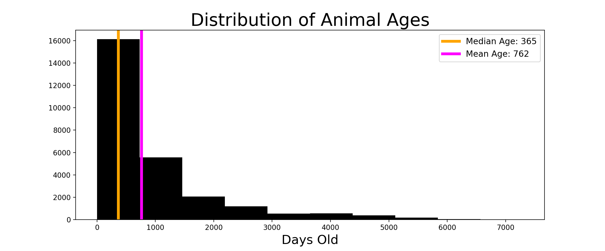

- [Problem Statement](#Problem-Statement)
- [Summary](#Summary)
- [Next Steps](#Next-Steps)
- [Data Dictionary](#Data-Dictionary)
- [External Resources](#External-Resources)

---

## Problem Statement

The goal of this project is to predict the outcome for cats and dogs in an animal shelter based on features like their type, sex, age, breed, and color. There are 5 possible outcomes:  
- Return to Owner
- Euthanasia
- Adoption
- Transfer
- Died

---

## Summary

Initial cleaning and EDA revealed a few interesting aspects in the data set. There were thousands of empty values in the name and outcome subytype columns, too many too drop, so I changed most of them to 'unnamed' and 'unknown' respectively. I also found that several names appear more frequently than others! Here is a table of the top 5 most frequent pet names in the animal shelter:

| name    |   appearance |
|:--------|-------:|
| Max     |    136 |
| Bella   |    135 |
| Charlie |    107 |
| Daisy   |    106 |
| Lucy    |     94 |

Another interesting facet was age distribution. Here is a histogram of age distribution among the animals in the shelter after converting all ages to the same units (days):

As we see in the image, most of the animals are under 1,000 days old with a tail that gives us a right-skew overall. That's why our mean is being pulled up to 762 days (~ 2 years) but the median is only 365 days (1 year).  

Moving into the modeling phase, here is the target variable distribution:

| outcome         |   normalized frequency |
|:----------------|--------------:|
| Adoption        |    0.40353    |
| Transfer        |    0.352231   |
| Return_to_owner |    0.179301   |
| Euthanasia      |    0.0581557  |
| Died            |    0.00678233 |

This means that my baseline accuracy would be 40%, i.e. predicting every animal as adopted would be correct roughly 40% of the time.  

#### Random Forest Model:  
A random forest model was my first idea to apply to this data set because the classification seemed ideal for a decision tree type system and random forest should one of the strongest applications of decision tree modeling. I had difficulty fighting the natural overfit that the random forest tends towards, eventually settling on a training score of 94% which generalized to a test score of 86%. With more time, I would have liked to narrow that gap further.  

#### KNN Model:  
The K-nearest neighbors model seemed like a decent option in case my data did not prove linear. After a cross-validated grid search I scored 87% on my training split and 79% on the test split.  

#### Logistic Regression Model:  
In order to perform logistic regression, I had to map my y-values into a single column (below) rather than dummifying them.  

| outcome         |   mapped value |
|:----------------|--------------:|
| Adoption        |    1   |
| Transfer        |    2  |
| Return_to_owner |    3  |
| Euthanasia      |    4  |
| Died            |    5 |

This model took the longest to run and in fact I had to trim my hyperparameters more than I preferred in order to get it to resolve within the alotted time.

#### Adaboost Model:  
My final model was an Adaboost Classifier which I hoped would give the best score.

---

## Next Steps

With more time and resources, I would be interested in pursuing:  
- further examination of the relationship between animal names and outcomes
- use of the date-time column to test if/how that feature impacts predictions
- further hyperparameter turning within my models

---

## Data Dictionary  

|Feature|Type|Description|
|---|---|---|
|**animalid**|str|unique animal ID number|
|**name**|str|the animal's name|
|**datetime**|str|time of outcome|
|**outcometype**|str|our prediction goal - Return_to_owner, Euthanasia, Adoption, Transfer, or Died|
|**outcomesubtype**|str|subset of outcome|
|**animaltype**|str|cat or dog|
|**sexuponoutcome**|str|male or female, neutered, spayed, or intact|
|**ageuponoutcome**|int|age of animal in days|
|**breed**|str|breed of animal|
|**color**|str|color of animal|

---

## External Resources  
https://www.kaggle.com/c/shelter-animal-outcomes/data?select=sample_submission.csv.gz